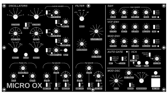

# Analog monosynth with digital control path

## The idea:
- A stripped down version of the [Josh Oxford Ribbon Synth](https://github.com/JordanAceto/josh_Ox_ribbon_synth) with some changes
- No integrated ribbon controller
- MIDI and CV inputs

## Status:
- 1st prototype is built and under evaluation
- All major features work
- There are a few PCB kludges required for the first board revisions
- Expect minor componenent and code changes as evalutation continues
- The jack panel, power supply, and body are not started yet
