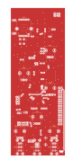

# Micro-Ox VCF/VCA Board

## [SCHEMATIC](https://github.com/JordanAceto/micro_ox/blob/main/circuit_boards/VCF_VCA_board/docs/VCF_VCA_board_schematic.pdf)

## Features
- SSI2140 pole-mixing filter with four outputs
    - 24dB/octave lowpass
    - 12dB/octave lowpass
    - 6dB/octave bandpass
    - 18dB/octave highpass
    - other filter responses are available by changing resistor weights
- Two linear SSI2164 VCAs
    - One dedicated to the envelope
    - One dedicated to the master volume

