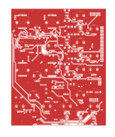

# Micro-Ox Dual SSI2130 VCO Board

## [SCHEMATIC](https://github.com/JordanAceto/micro_ox/blob/main/circuit_boards/main_VCO_board/docs/main_VCO_board_schematic.pdf)

## Features
- each VCO has sine, triangle, sawtooth, and variable pulse outputs
- octave switches and fine tuners
- suboctave with sawtooth and variable pulse waves
    - derived from VCO A
    - suboctave is not phase locked to VCO A, has variable beat frequency control
- flexible sync mode
    - VCO B may be soft-synced to VCO A
    - the `MOD B` setting turns off modulation to VCO A, so that only the synced VCO B is modulated
- audio mixer
- transformer/diode based ring modulator
    - XX mode multiplies VCO A with VCO B
    - XY mode multiplies VCO A with the MOD OSC
- PWM control generator
    - PWM control is clamped so the pulse waves can't go beyond about 5% and 95%
    - if overdriving the pulse waves is desired two diodes may be easily removed

