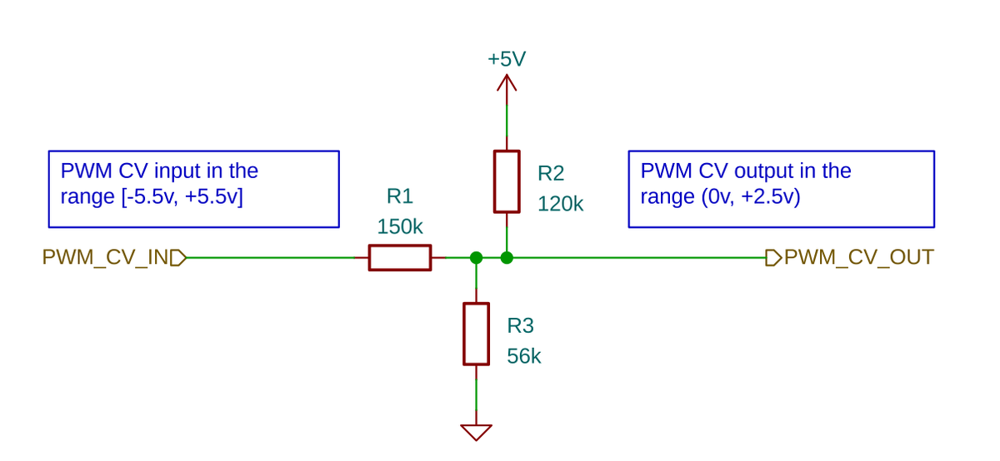
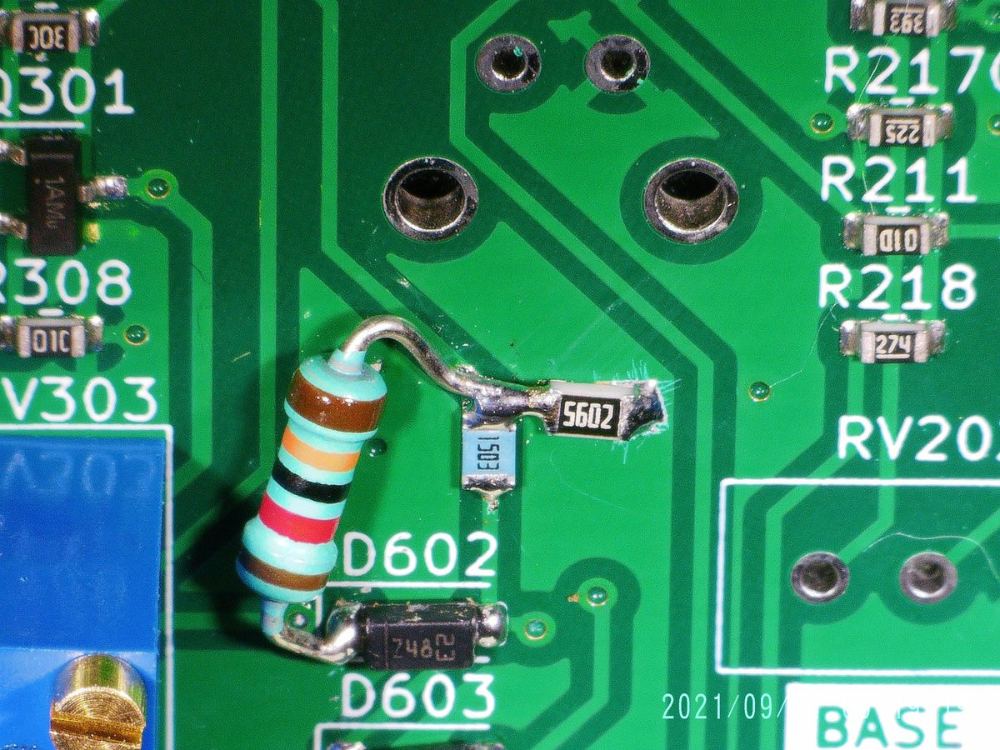

# VCO Board PCB Kludges

The VCO board needs a kludge to scale and clamp the PWM control voltage for the SSI2130 VCOs.

The PWM circuit on the VCO board is intended to clamp the pulse width modulation so that the width of the pulse wave can get very close to 0% and 100%, but not quite reach. This is to prevent the pulse wave from disappearing when the PWM is overdriven.

The existing clamper circuit clamps the PWM control signal to about [-5.5v, +5.5v]. This is fine for the suboctave pulse wave. But the main VCO A and VCO B pulse waves have a PWM port that is sensitive over [0v, +2.5v], and so it should be clamped to just inside this range.

The network shown below can be kludged in between the PWM output and the SSI2130 PWM input control ports.

This network should be installed so that the Suboctave PWM input still gets the full `[-5.5v, +5.5v]` range. 

A convenient spot to install the kludge is shown below. The input to the network is the trace coming out of the top of `D602`, and the output is the trace exiting the junction of the three kludged resistors.

- The trace going northwards from `D602` is carefully cut underneath the 150k ohm 0805 resistor, and the soldermask is carefully scraped away so that the 150k resistor can be soldered to it. 
- A small section of the soldermask covering the ground plane is scraped away so that the 56k ohm 0805 resistor can be soldered to ground.
- The 120k ohm through-hole resistor is wired to the left end of `D602`, which is connected to the +5v rail.

