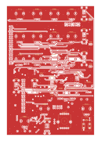

# Micro-Ox Modulation Board

## [SCHEMATIC](https://github.com/JordanAceto/micro_ox/blob/main/circuit_boards/modulation_board/docs/modulation_board_schematic.pdf)

## Features
- MIDI input listens for a variety of MIDI messages
    - note on/off
    - pitch bend
    - mod-wheel controls the amplitude of the MOD OSC
    - VCF frequency and VCF Q messages
    - master volume
    - more MIDI control may be added in the future (velocity, portamento, sustain, etc)
- Analog Modulation Oscillator
    - SSI2130 based design with good tracking
    - low, medium, and high frequency ranges for LFO and audio rate FM
    - variable key-tracking to follow the MIDI pitch control
    - sine, up-saw, down-saw, and 50% square waves available
    - on/off switch with variable rise/fall time
- two full ADSR envelopes
    - one dedicated to the VCF
    - MOD ENV for modulation purposes
- one AR envelope for the VCA
    - the VCA may be controlled by the dedicated AR, the MOD ENV, or set to drone mode
- sample & hold
    - glide control
    - 3 input mixer
    - s&h mixer output, for use as an auxilliary modulation bus
- flexible auto gate
    - choose either the PWM LFO (from the VCO board), MOD OSC, or a combination of the two as the auto gate source
    - in combination mode the PWM LFO and MOD OSC may be combined via logical operators AND, OR, and XOR
- flexible trigger control for envelopes and sample & hold
    - each component may be triggered by MIDI, external gate signals, the auto gate, or a logical combination

