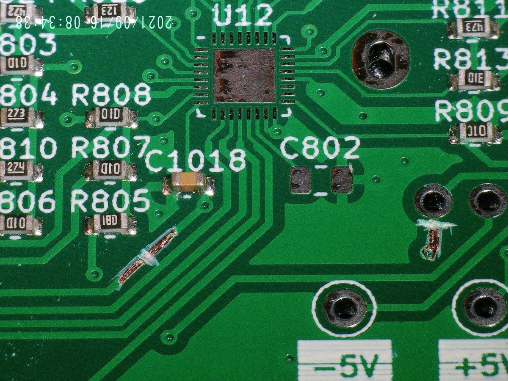

# Modulation Board PCB Kludges

The modulation board needs a kludge to ensure that the MODOSC frequency range switch does not short out the +/-5 volt power suppy rails, and a kludge to bias the pink noise.

## MODOSC frequency range switch kludge

### Step 1: cut two traces

In the vicinity of the MODOSC circuitry, carefully cut the two traces as shown with an exacto knife.

The trace on the left in the image supplies -5 volts DC to the MODOOSC frequency range switch, and the trace on the right supplies +5v.

### Step 2: scrape away solder mask

With the traces severed, carefully scrape away some soldermask to provide for a surface to solder to.

### Step 3: install two 51k ohm resistors

Solder 51k ohm resistors in series with the cut traces. This puts some impedance in series with the +/-5v lines, so even if the switch momentarily short out no drama will ensue.

---

## Pink Noise bias resistor kludge

Solder a 270k ohm resistor from the -5v rail (available on the left side of R907) and the inverting input of U7A.

