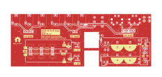
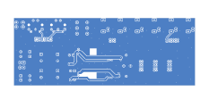

# Micro-Ox Power-Supply and IO board

## [SCHEMATIC](https://github.com/JordanAceto/micro_ox/blob/main/circuit_boards/power_supply_and_io_board/docs/power_supply_and_io_board_schematic.pdf)

Linear +/-12 volt DC power supply and input/output jacks

